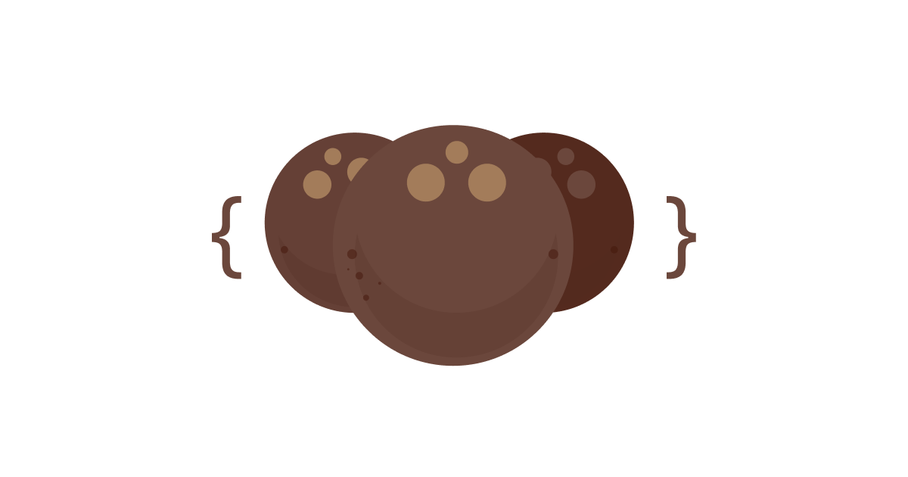

# Thengascript
## Start programming for the web in Malayalam



Ever wondered what it would be like to program for the web in Malayalam? This wonder is what drove the creation of Thengascript.

With it, you can start programming for the web today in Malayalam!

Check out the demos and documentation: http://makers-of-kerala.com/thengascript/

Underneath the hood, it translates your code to its ECMAscript equivalent which is then interpreted and ran by the browser.

## Docs

If you want to try the live examples above, you can input Malayalam using Google Input Tools Extension.

To write code on your computer download Thengascript and include it in your code as:

```js
<script src="thengascript.js"></script>
```

Now you can start Thengascripting in two ways. Include your inline code as:

```js
<script type="text/thengascript">

/* Write your Thengascript code here */

</script>

```

or you can also include the file using the src attribute:
```js
<script type="text/thengascript" src="your-thengascript-file.js"></script>
```

Sample files can be found inside the `demos/` folder.

(c) 2018-2024 — Makers of Kerala
MIT License - എന്ന് വെച്ചാ basically പൊളിച്ചടക്കാമെന്ന്
